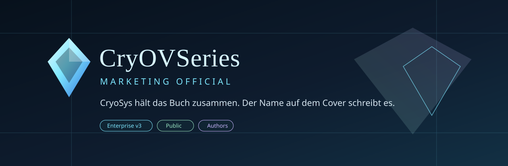

  

  <a href="docs/de/autoren.md">Deutsch</a>
  &nbsp;&middot;&nbsp;
  <a href="docs/en/authors.md">English</a>
  &nbsp;&middot;&nbsp;
  <a href="evidence/source-register.md">Quellen</a>
  &nbsp;&middot;&nbsp;
  <a href="evidence/claims-boundary.md">Claim-Grenze</a>

  
  
  
  
  

CryoSys für Autoren ist ein Arbeitsatelier für Recherche, Struktur, Stimmbibel, Konsistenz und Freigabe. Keine Buchfabrik. Kein stiller Ghostwriter. Der Mensch bleibt der Name auf dem Cover.

CryoSys for authors is a working atelier for research, structure, voice bible, consistency, and sign-off. Not a book mill. Not a silent ghostwriter. The human remains the name on the cover.

---

## Lesen

| | Deutsch | English |
|---|---|---|
| Verkaufsseite | [docs/de/autoren.md](docs/de/autoren.md) | [docs/en/authors.md](docs/en/authors.md) |
| Edition | [Community gegen Enterprise](edition/community-vs-enterprise.md) | same file, no invented prices |
| Belege | [Quellenregister](evidence/source-register.md) | nine public URLs, status on each |
| Grenze | [Claims boundary](evidence/claims-boundary.md) | what this pack may not say |
| Riegel | [Validation note](evidence/validation-note.md) | delivery bar, not a lab certificate |

## Satz der Seite

> CryoSys hält das Buch zusammen. Geschrieben wird es von dem Namen, der auf dem Cover steht.

> CryoSys holds the book together. The name on the cover writes it.

## Was öffentlich ist

Geprüfte Marketingseiten und das Quellenregister. Skill-Quellen, Prompts, Memory, Zugangsdaten, private Adressen und unveröffentlichte Preise liegen nicht in diesem Repo. Fremdtexte sind verlinkt, nicht kopiert.

## Riegel

Enterprise-Boden: Q mindestens 0.90, PIS mindestens 0.82, SafeMode Level 2. Diese Autorenseite: Q 0.92, PIS 0.84. Interner Lieferriegel, kein Fremdzertifikat.

Community v1 ist die kostenlose Lernlinie. Enterprise v3 ist Preis auf Anfrage, bis hier eine Zahl steht.

## Nicht behauptet

Kein Bestseller. Keine Verlagszusage. Keine Unsichtbarkeit. Keine erfundenen Kundenstimmen. Die 18 Prozent sind Plattformdaten, die Cambridge-Zahlen eine UK-Befragung. Details in der [Claim-Grenze](evidence/claims-boundary.md).

  Pierreg99 &middot; CryOVSeries Marketing Official &middot; 2026-10-09 &middot; <a href="NOTICE.md">NOTICE</a>

